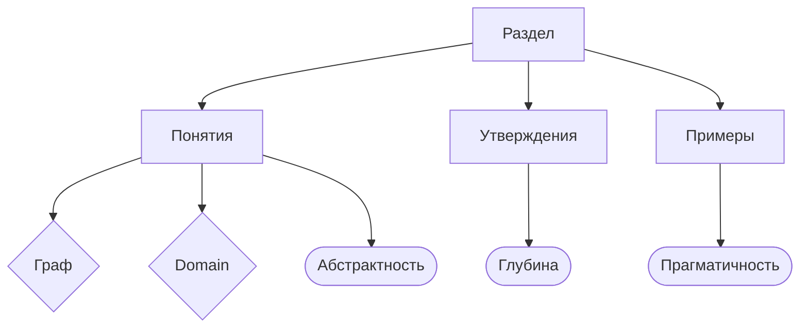

# Объясняю как этим пользоваться

1. Для начала скачиваем себе репу

    ```shell
    git clone git@github.com:makroguzov/lectorium.git
    ```

2. Переходим в корневую папку проекта

3. Запускаем кластер

    ```shell
    docker-compose up -d lectorium
    ```

4. Есть 2 ссылочки:

   [Доступ к API](http://localhost:8888/docs)

   [Файловое хранилище](http://localhost:9991/)

# Доступ к хранилищу
Для доступа к хранилищу нужно ввести следующие данные:

```
login: admin
password: pasword
```

# Что мы хотим

